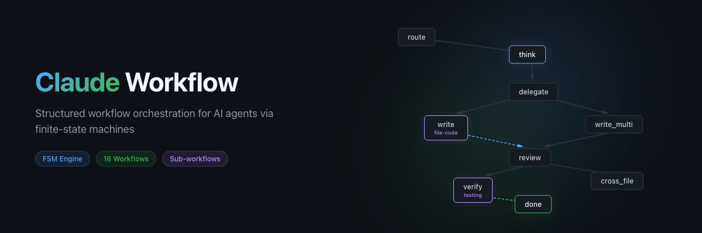
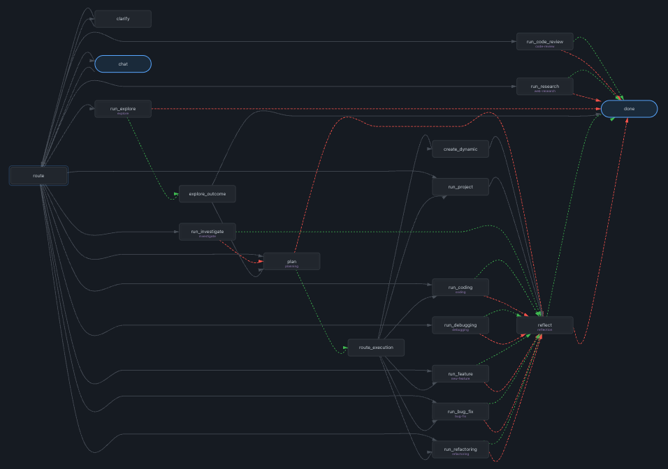
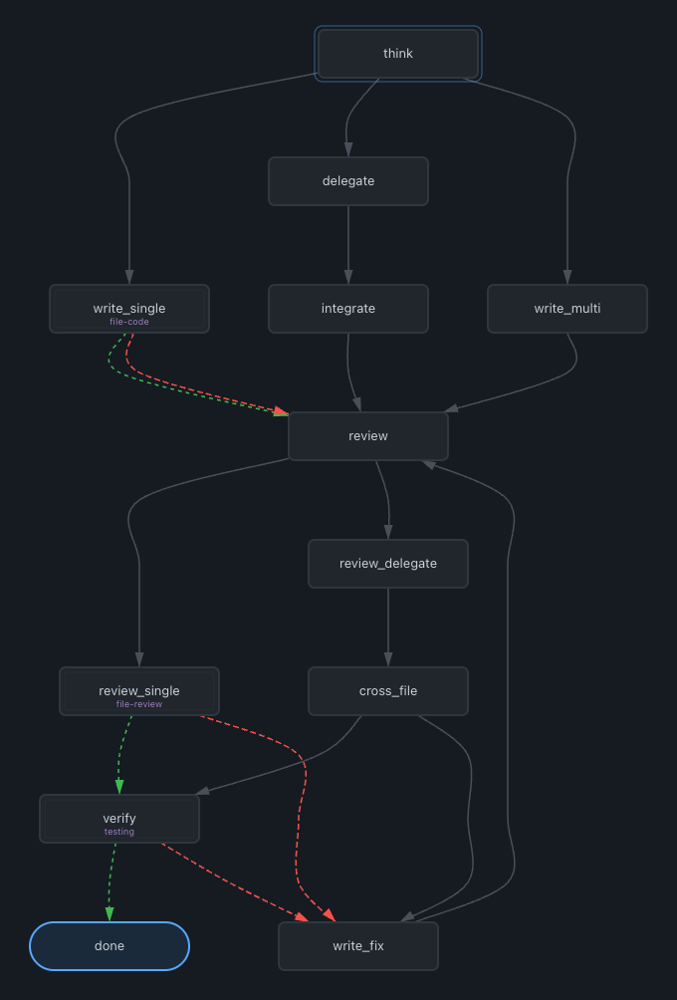

<p align="center">
  
</p>

<p align="center">
  <a href="package.json"></a>
  <a href="LICENSE"></a>
  <a href="https://www.typescriptlang.org/"></a>
  <a href="https://code.claude.com/docs/en/plugins"></a>
</p>

A Claude Code plugin that drives agents through YAML-defined state machines. The engine tracks state, enforces guards, manages nested sub-workflow stacks, and visualizes everything in a web dashboard.



## Features

- **FSM-based state machines** — define workflows in YAML with states, transitions, and prompts
- **Stack-based sub-workflows** — states can push nested workflows (max depth 10), auto-pop on completion
- **Three-tier loading** — bundled templates < global (`~/.claude/workflows/`) < project (`.claude/workflows/`)
- **Snapshot isolation** — workflow definitions frozen at session start; hot-reloads don't affect running sessions
- **Runtime overlays** — modify workflows on the fly without touching YAML files
- **Web dashboard** — real-time session monitoring with DAG graph visualization
- **16 bundled workflows** — complete agent lifecycle from routing to reflection
- **8 bundled skills** — reusable knowledge modules auto-provisioned on first run
- **SessionStart hook** — auto-provisions missing skills and injects workflow context

## Quick Start

### From the Official Marketplace

```
/plugin install workflow@claude-plugin-directory
```

### From GitHub

```bash
# 1. Add the repository as a marketplace source
/plugin marketplace add AxGord/claude-workflow

# 2. Install the plugin
/plugin install workflow@AxGord-claude-workflow
```

### Manual (for development)

```bash
git clone https://github.com/AxGord/claude-workflow.git
cd claude-workflow
npm install
npm run build
claude --plugin-dir ./
```

## How It Works

```
Agent                          Engine                         Storage
  │                              │                              │
  ├─ workflow_start() ──────────►│─ snapshot workflows ────────►│ session.json
  │◄──── initial state prompt ──│                              │
  │                              │                              │
  ├─ workflow_transition() ────►│─ validate & advance ────────►│ update JSON
  │◄──── new state prompt ──────│  (push/pop sub-workflows)    │
  │                              │                              │
  ├─ workflow_transition() ────►│─ terminal state? ───────────►│ mark complete
  │◄──── done ──────────────────│  (auto-pop to parent)        │
```

1. `workflow_start()` — creates a session, snapshots all workflow definitions, returns the initial state prompt
2. `workflow_transition()` — validates the transition, advances state, handles sub-workflow push/pop, returns the new prompt
3. Every mutation is atomically persisted to JSON (temp file + rename + lockfile)
4. Dashboard visualizes sessions and workflow graphs at `localhost:3100`

## Workflow YAML

```yaml
name: my-workflow
description: "Example workflow"
initial: start
max_transitions: 50

states:
  start:
    prompt: "Analyze the task and decide on approach"
    transitions:
      implement: write_code
      explore: research

  research:
    sub_workflow: explore        # pushes nested workflow
    on_complete: write_code      # returns here on success
    on_fail: start               # returns here on failure

  write_code:
    prompt: "Write the implementation"
    transitions:
      done: finish

  finish:
    terminal: true
    outcome: complete            # or "fail"
```

## Three-Tier Loading

Workflows load from three sources in ascending priority — later tiers override earlier ones:

| Tier | Path | Purpose |
|------|------|---------|
| Bundled | `templates/` (plugin root) | Base workflows shipped with the plugin |
| Global | `~/.claude/workflows/` | User customizations shared across projects |
| Project | `.claude/workflows/` | Project-specific workflows |

A project workflow named `coding` overrides the bundled `coding` template. Same-name global workflows sit in between.

## Bundled Workflows

| Workflow | Description |
|----------|-------------|
| `master` | Single entry point — analyzes task, loads skills, routes to sub-workflows |
| `coding` | Code writing pipeline: think → delegate → write → review → verify |
| `bug-fix` | Standard bug fix: classify → diagnose → fix → verify |
| `new-feature` | New feature implementation with planning and testing |
| `refactoring` | Bring every touched file to current standards |
| `debugging` | Diagnose first, fix never (until diagnosed) |
| `code-review` | Code review with per-file deep analysis |
| `explore` | Codebase exploration — understand structure, trace code, find patterns |
| `investigate` | Resolve unknowns before deciding on action |
| `planning` | Explore, design plan, record workflow context |
| `testing` | Testing verification — unit tests first, then integration |
| `web-research` | Check existing knowledge, then delegate to web subagents |
| `reflection` | Self-reflection after significant tasks — evaluate, classify, act |
| `subagent` | Lightweight routing for sub-agents (no chat/plan/reflect) |
| `file-code` | Per-file coding — spawned by coding/bug-fix for each file |
| `file-review` | Per-file deep review — spawned by code-review for each file |



## Bundled Skills

Skills are reusable knowledge modules loaded by workflows via `Skill()`. Auto-provisioned to `~/.claude/skills/` on first run if missing.

| Skill | Description |
|-------|-------------|
| `preferences` | User's general coding preferences |
| `architecture` | Simplicity-first architecture decisions |
| `task-delegation` | When and how to delegate to subagents |
| `coding-skill-selector` | Select and load coding skills by file extensions and domains |
| `lang-haxe` | Haxe language gotchas |
| `lang-python` | Python language gotchas |
| `math` | Math overflow boundary gotchas |
| `web-reading` | Fetch web content via subagents |

## MCP Tools

All tools are registered under the `wf` server. Full tool prefix: `mcp__plugin_workflow_wf__`.

| Tool | Description | Key Parameters |
|------|-------------|----------------|
| `workflow_list` | List all available workflow definitions | — |
| `workflow_start` | Start a workflow, return initial prompt | `workflow`, `actor`, `parent_session_id` |
| `workflow_status` | Get current state, stack, transitions, history | `session_id` |
| `workflow_transition` | Advance to next state (auto push/pop sub-workflows) | `session_id`, `transition` |
| `workflow_context_set` | Save key-value data in session context | `session_id`, `key`, `value` |
| `workflow_modify` | Runtime overlay — add/change/remove states and transitions | `session_id`, `add_state`, `add_transition` |
| `workflow_create` | Create new workflow definition (saves YAML) | `name`, `definition`, `scope` |
| `workflow_delete` | Delete a workflow definition | `name`, `scope` |
| `workflow_abort` | Abort workflow, pop all stack frames | `session_id` |
| `workflow_sessions` | List all sessions (active first) | — |

## Dashboard

The web dashboard runs on `localhost:3100` and provides real-time monitoring:

- **Sessions panel** — active, completed, and abandoned sessions with status badges
- **Workflow list** — all loaded workflows with state counts
- **Session detail** — full state history, stack depth, context data
- **Workflow graphs** — interactive DAG visualization rendered with dagre

### REST API

| Method | Endpoint | Description |
|--------|----------|-------------|
| `GET` | `/api/sessions` | List all sessions |
| `GET` | `/api/session/:id` | Get session detail |
| `POST` | `/api/session/:id/abandon` | Abandon a session |
| `GET` | `/api/workflows` | List all workflow definitions |

## Configuration

| Variable | Default | Purpose |
|----------|---------|---------|
| `WORKFLOW_DIR` | `~/.claude/workflows/` | Global workflow YAML directory |
| `STATE_DIR` | `~/.claude/workflow-state/` | Session JSON persistence |
| `DASHBOARD_PORT` | `3100` | Web dashboard HTTP port |

## Development

```bash
npm run build    # tsc → compiles src/ to build/
npm run dev      # tsc --watch
npm start        # node build/index.js
```

### Architecture

| File | Responsibility |
|------|---------------|
| `src/index.ts` | Entry point — resolves dirs, wires components, starts stdio transport |
| `src/engine.ts` | FSM core — start, transition, abort, context, stack push/pop |
| `src/loader.ts` | YAML loading + Zod validation + fs.watch hot-reload |
| `src/storage.ts` | JSON persistence with atomic writes and lockfile mutex |
| `src/modifier.ts` | Runtime overlays + workflow_create (YAML writer) |
| `src/tools.ts` | MCP tool registrations + response formatting |
| `src/dashboard.ts` | Express REST API + static file serving |
| `src/types.ts` | Zod schemas, TypeScript types, constants |

## License

MIT
